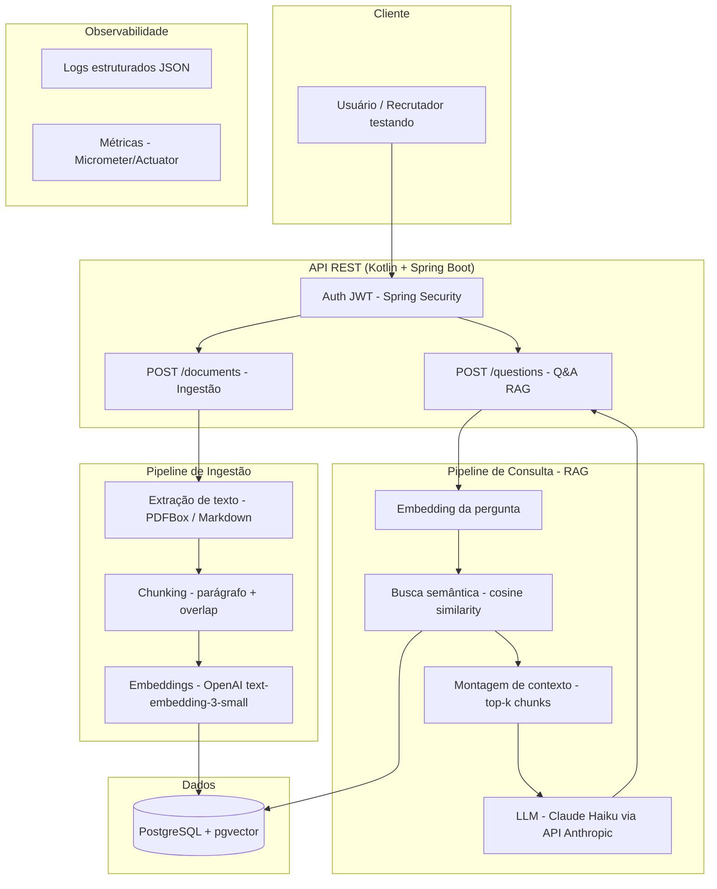

# 00 — Arquitetura FinRAG

## Contexto

API REST em Kotlin + Spring Boot que implementa um pipeline RAG (Retrieval-Augmented
Generation) sobre documentos financeiros (relatórios, demonstrativos). Projeto de
portfólio para demonstrar competência em backend Kotlin aplicado a IA.

## Objetivo do sistema

Permitir que um usuário autenticado envie documentos (PDF/Markdown) e faça perguntas
em linguagem natural sobre o conteúdo, recebendo respostas fundamentadas nos trechos
mais relevantes do(s) documento(s), com custo mínimo de operação.

## Status dos marcos

| Marco | Descrição | Status |
|-------|-----------|--------|
| M0 | Setup do projeto (Docker, CI, tooling) | ✅ Concluído |
| M1 | Autenticação (JWT) | ✅ Concluído |
| M2 | Ingestão de documentos (PDF/Markdown → chunking → embeddings) | ✅ Concluído |
| M3 | Q&A sobre documentos indexados (RAG) | ✅ Concluído |
| M4 | Observabilidade do pipeline RAG | ✅ Concluído |
| M5 | Gestão de documentos (GET/DELETE, paginação) | ✅ Concluído |
| M6 | Docs da API + hardening | ✅ Concluído |
| M7 | Deploy (Render + Neon, URL pública) | ✅ Concluído |
| M8 | Avaliação de RAG (golden dataset, calibração de retrieval) | 🔄 Em andamento |
| M9 | Backlog opcional (multi-tenancy, re-ranking, SSE, async) | 💤 Backlog |

Roadmap com motivação de cada marco futuro e ordem de prioridade em
`specs/01-roadmap.md`. Detalhe de cada marco já iniciado (critérios de
aceite, decisões técnicas, checklist) em `specs/MX-requirements.md` /
`MX-design.md` / `MX-tasks.md`.

## Diagrama de arquitetura



## Estrutura de pastas (Clean Architecture pragmática)

```
finrag/
├── src/main/kotlin/com/eloiza/finrag/
│   ├── domain/
│   │   ├── model/           # Document, Chunk, Answer
│   │   └── port/            # EmbeddingProvider, LlmClient, ChunkRepository (interfaces)
│   ├── application/         # casos de uso (orquestram o domínio)
│   ├── infrastructure/
│   │   ├── persistence/     # JPA + pgvector
│   │   ├── openai/          # cliente de embeddings
│   │   ├── anthropic/       # cliente LLM
│   │   ├── parsing/         # extração de texto e chunking
│   │   └── security/        # JWT
│   └── api/                 # controllers, DTOs, exception handling
├── src/test/kotlin/
├── specs/                   # este diretório (SDD)
├── docker-compose.yml
├── .github/workflows/ci.yml
└── README.md
```

**Regra de dependência**: `domain` não depende de nada. `application` depende só de
`domain`. `infrastructure` e `api` dependem de `domain`/`application`, nunca o
contrário. Isso é o que permite trocar OpenAI por outro provedor de embeddings sem
tocar no core.

## Decisões de arquitetura (ADRs resumidos)

| # | Decisão | Alternativas consideradas | Motivo da escolha |
|---|---|---|---|
| ADR-01 | pgvector como vector store | Pinecone, Qdrant, Weaviate | Reaproveita PostgreSQL já dominado; sem infra/custo extra; performático até ~1M vetores; transação única entre dados relacionais e vetoriais |
| ADR-02 | OpenAI `text-embedding-3-small` | Cohere, embeddings locais (ONNX) | Custo desprezível; Anthropic não oferece API de embeddings; modelo local complica deploy sem ganho relevante para portfólio |
| ADR-03 | Claude Haiku 4.5 como LLM de resposta | GPT-4o-mini, modelo local | Barato e rápido, suficiente para Q&A com contexto curto; abstraído atrás de `LlmClient` para permitir troca |
| ADR-04 | Pipeline RAG implementado manualmente (sem Spring AI/LangChain4j) | Spring AI | Projeto pequeno o suficiente para implementar na mão; maximiza aprendizado e capacidade de defender cada etapa em entrevista |
| ADR-05 | Ingestão síncrona no MVP | Fila assíncrona (Kafka/SQS) desde o início | Reduz complexidade inicial; evolução para assíncrono fica como marco opcional (M9), demonstrando visão de escalabilidade |
| ADR-06 | Clean Architecture com 4 camadas | Arquitetura em camadas tradicional (controller-service-repository) | Isola regras de negócio de frameworks e provedores externos; facilita testes unitários sem Testcontainers |

## Restrições do projeto

- Custo de operação próximo de zero (free tier de LLM/embeddings, sem infra paga além do necessário)
- Cobertura de testes relevante (Kotest + Testcontainers para integração)
- Commits semânticos, CI obrigatório antes de merge
- Código escrito e compreendido pela autora — specs guiam, não substituem a implementação

## Fora de escopo (v1)

- Multi-tenancy real (autenticação existe, mas sem isolamento de dados por organização)
- Re-ranking de resultados de busca
- Streaming de resposta (SSE) — candidato a M9
- Suporte a outros formatos além de PDF/Markdown
- Avaliação automatizada de qualidade de RAG (golden dataset) — candidato a M9

## Glossário rápido

- **Chunk**: fragmento de texto extraído de um documento, pequeno o suficiente para gerar um embedding coerente
- **Embedding**: vetor numérico que representa o significado semântico de um texto
- **RAG**: técnica que busca trechos relevantes (retrieval) e injeta no prompt do LLM antes de gerar a resposta (generation)
- **Top-k**: os k chunks mais similares à pergunta, segundo a busca vetorial
